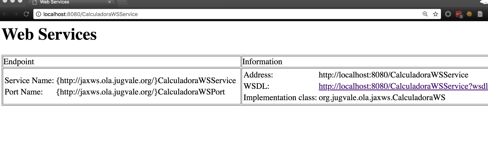
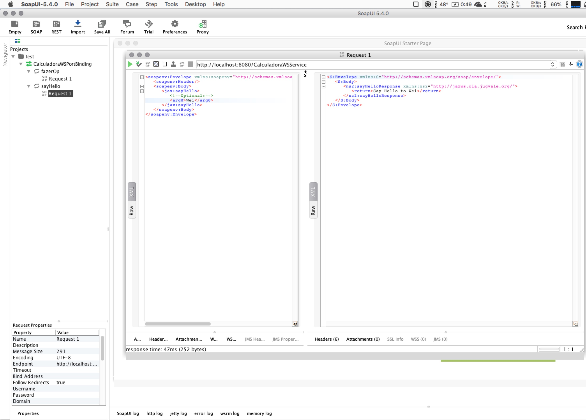

# A Java SOAP Web Service Demo


# Prerequisites

1. [Java](http://www.oracle.com/technetwork/java/javase/downloads/jdk8-downloads-2133151.html) 8+
2. [Maven](https://maven.apache.org) 3+


# How to run

### Clone

```
git clone git@github.com:swsmile/java-soap-demoUsingJaxWS.git
```

### Inside

```
cd java-soap-demoUsingJaxWS
```

### Run

```
mvn package
mvn embedded-glassfish:run -Dhttp.port=8080
```

### Output

```
[INFO] Scanning for projects...
[INFO]
[INFO] --------------< org.jugvale.ola.jaxws:calculadora-jax-ws >--------------
[INFO] Building calculadora-jax-ws 0.0.1-SNAPSHOT
[INFO] --------------------------------[ war ]---------------------------------
[INFO]
[INFO] --- maven-embedded-glassfish-plugin:4.1.1:run (default-cli) @ calculadora-jax-ws ---
Created New Bootstrap ClassLoader. ServerId = maven, ClassPaths =
ClassPath Element : file:/Users/weishi/.m2/repository/org/glassfish/embedded/maven-embedded-glassfish-plugin/4.1.1/maven-embedded-glassfish-plugin-4.1.1.jar
ClassPath Element : file:/Users/weishi/.m2/repository/org/glassfish/main/extras/glassfish-embedded-all/4.1/glassfish-embedded-all-4.1.jar
ClassPath Element : file:/Library/Java/JavaVirtualMachines/jdk1.8.0_161.jdk/Contents/Home/jre/../lib/tools.jar
ClassPath Element : file:/Users/weishi/.m2/repository/org/codehaus/plexus/plexus-utils/1.0.4/plexus-utils-1.0.4.jar
ClassPath Element : file:/Users/weishi/.m2/repository/junit/junit/3.8.1/junit-3.8.1.jar
ClassPath Element : file:/Users/weishi/.m2/repository/org/glassfish/main/common/simple-glassfish-api/4.1.1/simple-glassfish-api-4.1.1.jar
Found populator: org.glassfish.kernel.embedded.EmbeddedDomainXml
May 23, 2018 9:39:36 PM org.glassfish.security.services.impl.authorization.AuthorizationServiceImpl initialize
INFO: Authorization Service has successfully initialized.
May 23, 2018 9:39:36 PM org.hibernate.validator.internal.util.Version <clinit>
INFO: HV000001: Hibernate Validator 5.0.0.Final
May 23, 2018 9:39:36 PM PluginUtil getGlassFish
INFO: Created GlassFish ServerId = maven, BootstrapProperties = {GlassFish_Platform=Static}, GlassFishRuntime = com.sun.enterprise.glassfish.bootstrap.StaticGlassFishRuntime@4860827a, GlassFishProperties = {embedded-glassfish-config.server.network-config.network-listeners.network-listener.http-listener.enabled=true, embedded-glassfish-config.server.network-config.network-listeners.network-listener.http-listener.port=8080}, GlassFish = com.sun.enterprise.glassfish.bootstrap.StaticGlassFishRuntime$1@404db674, GlassFish Status = INIT, TimeTaken = 936 ms
May 23, 2018 9:39:37 PM com.sun.enterprise.v3.services.impl.GrizzlyProxy start0
INFO: Grizzly Framework 2.3.15 started in: 43ms - bound to [/0.0.0.0:8080]
May 23, 2018 9:39:37 PM com.sun.enterprise.v3.services.impl.GrizzlyService createNetworkProxy
INFO: Network listener https-listener on port 0 disabled per domain.xml
May 23, 2018 9:39:37 PM com.sun.enterprise.v3.admin.adapter.AdminEndpointDecider setGuiContextRoot
INFO: Admin Console Adapter: context root: /admin
May 23, 2018 9:39:37 PM com.sun.enterprise.v3.admin.adapter.AdminEndpointDecider setGuiContextRoot
INFO: Admin Console Adapter: context root: /admin
May 23, 2018 9:39:37 PM com.sun.enterprise.v3.admin.adapter.AdminEndpointDecider setGuiContextRoot
INFO: Admin Console Adapter: context root: /admin
May 23, 2018 9:39:37 PM com.sun.enterprise.v3.server.AppServerStartup postStartupJob
INFO: Undefined Product Name - define product and version info in config/branding  0.0.0  (0) startup time : Embedded (803ms), startup services(876ms), total(1,679ms)
May 23, 2018 9:39:37 PM org.glassfish.admin.mbeanserver.JMXStartupService$JMXConnectorsStarterThread run
INFO: JMXStartupService has disabled JMXConnector system
May 23, 2018 9:39:37 PM com.sun.enterprise.connectors.jms.util.JmsRaUtil getInstalledMqVersion
WARNING: jmsra.upgrade_check_failed
May 23, 2018 9:39:37 PM PluginUtil startGlassFish
INFO: Started GlassFish ServerId = maven, GlassFish = com.sun.enterprise.glassfish.bootstrap.StaticGlassFishRuntime$1@404db674, TimeTaken = 1,127 ms
May 23, 2018 9:39:37 PM org.glassfish.maven.PluginUtil doDeploy
INFO: Deploying [/Volumes/Working/platground/soap/java-soap-demo/target/calculadora-jax-ws.war] with parameters [--force=true, --contextroot=/]
May 23, 2018 9:39:38 PM org.glassfish.webservices.metroglue.MetroContainer postConstruct
INFO: Web service endpoint deployment events listener registered successfully.
May 23, 2018 9:39:38 PM com.sun.enterprise.security.SecurityLifecycle <init>
INFO: Java security manager is disabled.
May 23, 2018 9:39:38 PM com.sun.enterprise.security.SecurityLifecycle onInitialization
INFO: Entering Security Startup Service.
May 23, 2018 9:39:38 PM com.sun.enterprise.security.PolicyLoader loadPolicy
INFO: Loading policy provider com.sun.enterprise.security.jacc.provider.SimplePolicyProvider.
May 23, 2018 9:39:38 PM com.sun.enterprise.security.auth.realm.Realm doInstantiate
INFO: Realm [admin-realm] of classtype [com.sun.enterprise.security.auth.realm.file.FileRealm] successfully created.
May 23, 2018 9:39:38 PM com.sun.enterprise.security.auth.realm.Realm doInstantiate
INFO: Realm [file] of classtype [com.sun.enterprise.security.auth.realm.file.FileRealm] successfully created.
May 23, 2018 9:39:38 PM com.sun.enterprise.security.auth.realm.Realm doInstantiate
INFO: Realm [certificate] of classtype [com.sun.enterprise.security.auth.realm.certificate.CertificateRealm] successfully created.
May 23, 2018 9:39:38 PM com.sun.enterprise.security.SecurityLifecycle onInitialization
INFO: Security Service(s) started successfully.
May 23, 2018 9:39:38 PM com.sun.enterprise.web.WebContainer createHttpListener
INFO: Created HTTP listener http-listener on host/port 0.0.0.0:8080
May 23, 2018 9:39:38 PM com.sun.enterprise.web.VirtualServer addProbes
SEVERE: Error adding HttpProbes. NetworkListener https-listeners GrizzlyProxy is NULL
May 23, 2018 9:39:38 PM com.sun.enterprise.web.WebContainer createHosts
INFO: Created virtual server server
May 23, 2018 9:39:38 PM org.apache.catalina.realm.JAASRealm setContainer
INFO: Setting JAAS app name glassfish-web
May 23, 2018 9:39:38 PM com.sun.enterprise.web.WebContainer loadSystemDefaultWebModules
INFO: Virtual server server loaded default web module
May 23, 2018 9:39:39 PM org.glassfish.webservices.WebServicesDeployer doWebServiceDeployment
INFO: Webservice Endpoint deployed CalculadoraWS
 listening at address at http://pc-199-121.customer.sircharles.liberty.lan:8080//CalculadoraWSService.
May 23, 2018 9:39:39 PM org.glassfish.webservices.metroglue.MetroContainer deployWsTxServices
INFO: Loading WS-TX Services. Please wait.
May 23, 2018 9:39:39 PM org.glassfish.webservices.metroglue.MetroContainer deployWsTxServices
WARNING: Cannot deploy or load WS-TX Services: Required WAR file (wstx-services.war) is not installed
May 23, 2018 9:39:40 PM com.sun.enterprise.web.WebApplication start
INFO: Loading application [calculadora-jax-ws] at [/]
May 23, 2018 9:39:40 PM org.glassfish.deployment.admin.DeployCommand execute
INFO: calculadora-jax-ws was successfully deployed in 2,317 milliseconds.
May 23, 2018 9:39:40 PM PluginUtil doDeploy
INFO: Deployed calculadora-jax-ws
Hit ENTER to redeploy, X to exit
```

### Endpoint

[http://localhost:8080/CalculadoraWSService](http://localhost:8080/CalculadoraWSService)



### WSDL

[http://localhost:8080/CalculadoraWSService?wsdl](http://localhost:8080/CalculadoraWSService?wsdl)

```xml
<?xml version="1.0" encoding="UTF-8"?>
<!--
 Published by JAX-WS RI (http://jax-ws.java.net). RI's version is Metro/2.3.1-b419 (branches/2.3.1.x-7937; 2014-08-04T08:11:03+0000) JAXWS-RI/2.2.10-b140803.1500 JAXWS-API/2.2.11 JAXB-RI/2.2.10-b140802.1033 JAXB-API/2.2.12-b140109.1041 svn-revision#unknown. 
-->
<!--
 Generated by JAX-WS RI (http://jax-ws.java.net). RI's version is Metro/2.3.1-b419 (branches/2.3.1.x-7937; 2014-08-04T08:11:03+0000) JAXWS-RI/2.2.10-b140803.1500 JAXWS-API/2.2.11 JAXB-RI/2.2.10-b140802.1033 JAXB-API/2.2.12-b140109.1041 svn-revision#unknown. 
-->
<definitions xmlns="http://schemas.xmlsoap.org/wsdl/" xmlns:soap="http://schemas.xmlsoap.org/wsdl/soap/" xmlns:tns="http://jaxws.ola.jugvale.org/" xmlns:wsam="http://www.w3.org/2007/05/addressing/metadata" xmlns:wsp="http://www.w3.org/ns/ws-policy" xmlns:wsp1_2="http://schemas.xmlsoap.org/ws/2004/09/policy" xmlns:wsu="http://docs.oasis-open.org/wss/2004/01/oasis-200401-wss-wssecurity-utility-1.0.xsd" xmlns:xsd="http://www.w3.org/2001/XMLSchema" targetNamespace="http://jaxws.ola.jugvale.org/" name="CalculadoraWSService">
   <types>
      <xsd:schema>
         <xsd:import namespace="http://jaxws.ola.jugvale.org/" schemaLocation="http://localhost:8080/CalculadoraWSService?xsd=1" />
      </xsd:schema>
   </types>
   <message name="sayHello">
      <part name="parameters" element="tns:sayHello" />
   </message>
   <message name="sayHelloResponse">
      <part name="parameters" element="tns:sayHelloResponse" />
   </message>
   <message name="fazerOp">
      <part name="parameters" element="tns:fazerOp" />
   </message>
   <message name="fazerOpResponse">
      <part name="parameters" element="tns:fazerOpResponse" />
   </message>
   <portType name="CalculadoraWS">
      <operation name="sayHello">
         <input wsam:Action="http://jaxws.ola.jugvale.org/CalculadoraWS/sayHelloRequest" message="tns:sayHello" />
         <output wsam:Action="http://jaxws.ola.jugvale.org/CalculadoraWS/sayHelloResponse" message="tns:sayHelloResponse" />
      </operation>
      <operation name="fazerOp">
         <input wsam:Action="http://jaxws.ola.jugvale.org/CalculadoraWS/fazerOpRequest" message="tns:fazerOp" />
         <output wsam:Action="http://jaxws.ola.jugvale.org/CalculadoraWS/fazerOpResponse" message="tns:fazerOpResponse" />
      </operation>
   </portType>
   <binding name="CalculadoraWSPortBinding" type="tns:CalculadoraWS">
      <soap:binding transport="http://schemas.xmlsoap.org/soap/http" style="document" />
      <operation name="sayHello">
         <soap:operation soapAction="" />
         <input>
            <soap:body use="literal" />
         </input>
         <output>
            <soap:body use="literal" />
         </output>
      </operation>
      <operation name="fazerOp">
         <soap:operation soapAction="" />
         <input>
            <soap:body use="literal" />
         </input>
         <output>
            <soap:body use="literal" />
         </output>
      </operation>
   </binding>
   <service name="CalculadoraWSService">
      <port name="CalculadoraWSPort" binding="tns:CalculadoraWSPortBinding">
         <soap:address location="http://localhost:8080/CalculadoraWSService" />
      </port>
   </service>
</definitions>
```

### xsd
http://localhost:8080/CalculadoraWSService?xsd=1
```
<?xml version="1.0" encoding="utf-8"?>

<!--
 Published by JAX-WS RI (http://jax-ws.java.net). RI's version is Metro/2.3.1-b419 (branches/2.3.1.x-7937; 2014-08-04T08:11:03+0000) JAXWS-RI/2.2.10-b140803.1500 JAXWS-API/2.2.11 JAXB-RI/2.2.10-b140802.1033 JAXB-API/2.2.12-b140109.1041 svn-revision#unknown. 
-->
<xs:schema xmlns:xs="http://www.w3.org/2001/XMLSchema" xmlns:tns="http://jaxws.ola.jugvale.org/" version="1.0" targetNamespace="http://jaxws.ola.jugvale.org/">  
  <xs:element name="fazerOp" type="tns:fazerOp"/>  
  <xs:element name="fazerOpResponse" type="tns:fazerOpResponse"/>  
  <xs:element name="sayHello" type="tns:sayHello"/>  
  <xs:element name="sayHelloResponse" type="tns:sayHelloResponse"/>  
  <xs:complexType name="fazerOp"> 
    <xs:sequence> 
      <xs:element name="num1" type="xs:double"/>  
      <xs:element name="num2" type="xs:double"/>  
      <xs:element name="op" type="xs:string" minOccurs="0"/> 
    </xs:sequence> 
  </xs:complexType>  
  <xs:complexType name="fazerOpResponse"> 
    <xs:sequence> 
      <xs:element name="return" type="xs:double"/> 
    </xs:sequence> 
  </xs:complexType>  
  <xs:complexType name="sayHello"> 
    <xs:sequence> 
      <xs:element name="arg0" type="xs:string" minOccurs="0"/> 
    </xs:sequence> 
  </xs:complexType>  
  <xs:complexType name="sayHelloResponse"> 
    <xs:sequence> 
      <xs:element name="return" type="xs:string" minOccurs="0"/> 
    </xs:sequence> 
  </xs:complexType> 
</xs:schema>

```


### Client

- SoapUI > SOAP > Initial WSDL > [http://localhost:8080/CalculadoraWSService?wsdl](http://localhost:8080/CalculadoraWSService?wsdl)
- You can choose a method you want to call on the left panel, e.g. `fazerOp` or `sayHello`



##### Request

```
<soapenv:Envelope xmlns:soapenv="http://schemas.xmlsoap.org/soap/envelope/" xmlns:jax="http://jaxws.ola.jugvale.org/">
   <soapenv:Header/>
   <soapenv:Body>
      <jax:sayHello>
         <!--Optional:-->
         <arg0>Wei</arg0>
      </jax:sayHello>
   </soapenv:Body>
</soapenv:Envelope>
```


##### Response

```
<S:Envelope xmlns:S="http://schemas.xmlsoap.org/soap/envelope/">
   <S:Body>
      <ns2:sayHelloResponse xmlns:ns2="http://jaxws.ola.jugvale.org/">
         <return>Say Hello to Wei</return>
      </ns2:sayHelloResponse>
   </S:Body>
</S:Envelope>
```


# References

[Maven plugin for GlassFish](https://jinahya.wordpress.com/2015/04/23/using-maven-embedded-glassfish-plugin-4-x/)

[WebServices SOAP with JAX-WS](http://aprendendo-javaee.blogspot.com.es/2014/01/introducao-web-services-soap-com-jax-ws.html)

